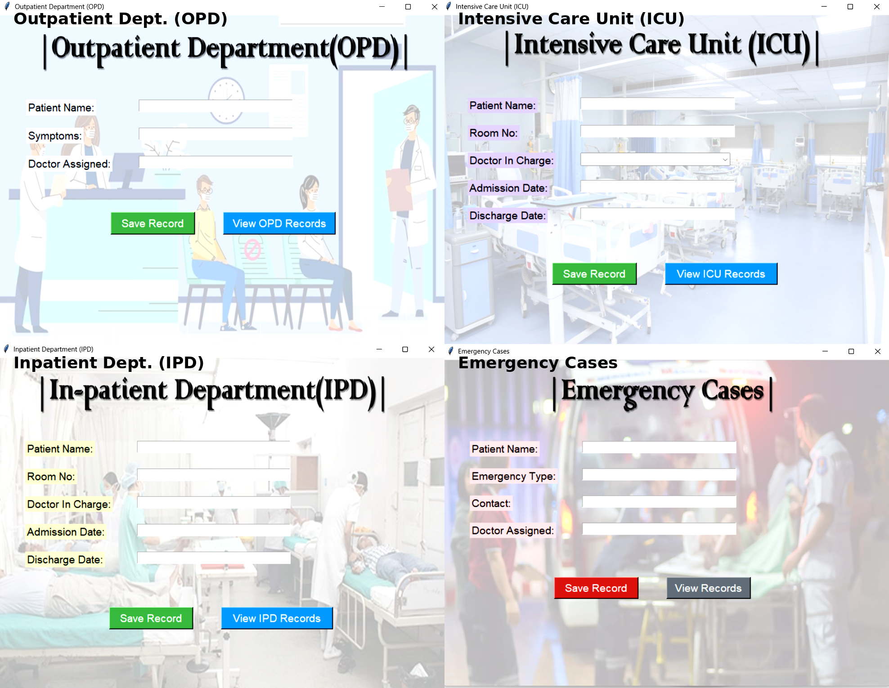

# 🏥 Hospital Management System - Python

This is a GUI-based Hospital Management System developed using **Python**. It simulates the operations of a real hospital through separate functional modules like Admin, Doctor, Reception, and Management. The project is designed to help manage hospital data efficiently using a clean graphical interface.

> ⚡ Built with **70% AI assistance (ChatGPT)** and **30% manual effort**, including design, debugging, and testing.

---

## 🚀 Features

- ✅ Secure Login system
- ✅ Separate dashboards for:
  - Admin
  - Doctor
  - Reception
  - Management
- ✅ Patient records and appointment management
- ✅ Emergency, ICU, IPD, OPD access buttons
- ✅ User-friendly GUI using Tkinter
- ✅ SQLite3 database integration
- ✅ Screenshot previews included

---

## 🛠️ Tools & Technologies Used

| Component        | Tool/Library         |
|------------------|----------------------|
| Programming Lang | Python 3.13          |
| GUI Framework    | Tkinter              |
| Database         | SQLite3              |
| IDE              | VS Code / Anaconda   |
| Version Control  | Git + GitHub         |
| Support Tools    | AI Assistance via ChatGPT |

---

## 📂 Project Structure

Hospital_Management_System-Python/
│
├── Admin/
│ └── admin.py
├── Doctor/
│ └── doctor.py
├── Management/
│ └── management.py
├── Reception/
│ └── reception.py
├── Database/
│ └── database.py
├── Photos/ # All GUI icons used in the app
│ └── *.png
├── ScreenShots/ # GUI screenshots
│ └── *.png
├── main_file.py # Main launcher file
├── README.md # This file

## 🖼️ Screenshots

---

## 🖼️ Screenshots

### 🔒 Login Page

### 🏥 Admin_Dashboard

### 🧾 Doctor_Dashboard

### 🧐 Function of Doctor_Dashboard

### 📋 Reception_dashboard

### 🧐 Function of Reception_dashboard

### 📋 Management_Dashboard

### 🧐 functions of Management_Dashboard

